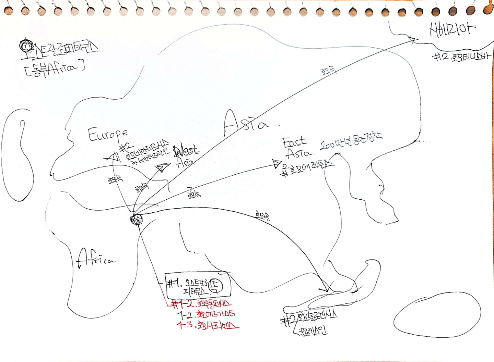

# 사피엔스

| 현재로 부터 XX전 | --                             | --                                                 |
| ---------------- | ------------------------------ | -------------------------------------------------- |
| 13,500,000,000   | 물질 + 에너지 (물리)           |                                                    |
| 4,500,000,000    | 원자, 분자(화학)               |                                                    |
| 3,800,000,000    | 생명체(생물)                   |                                                    |
| 6,000,000        | 인류, 침팬지 공통조상          |                                                    |
| 2,500,000        | 석기이용                       | 아프리카 동부 오스트랄로 피테쿠스 속의 존재 끝. |
| 2,000,000        | 유라시아로 이주                | 인간종 다양화됨. 채식위주 생활 종료             |
| 500,000          | 네안데르탈인(유럽)             | 육식시작                                           |
| 300,000          | 불 사용법 터득                 |                                                    |
| 200,000          | 호모사피엔스(동부아프리카)     | 인류 최고의 먹이사슬 정점을 찍음                   |
| 70,000           | 언어습득(인지혁명)             |                                                    |
| 45,000           | 호모사피엔스 호주 정착         |                                                    |
| 30,000           | 네안데르탈인 멸종              |                                                    |
| 16,000           | 호모사피엔스 아메리카 정착     |                                                    |
| 13,000           |                                |                                                    |
| 12,000           | 농업혁명                       |                                                    |
| 5,000            | 왕국, 화폐, 종교               |                                                    |
| 4,250            | 제국                           |                                                    |
| 2,500            | 주화, 페르시아, 인도           |                                                    |
| 2,000            | 한 제국, 로마제국, 기독교 전파 |                                                    |
| 1,400            | 이슬람                         |                                                    |
| 500              | 유럽 -> 아메리카               | 과학혁명                                           |
| 200              | 산업혁명                       |                                                    |

